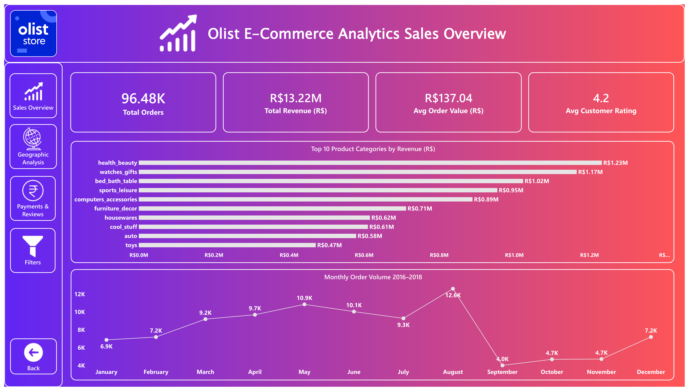
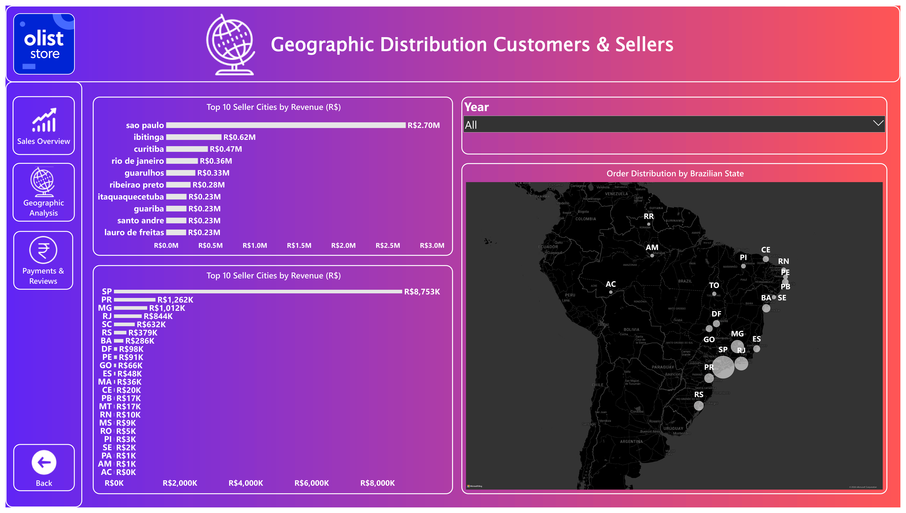
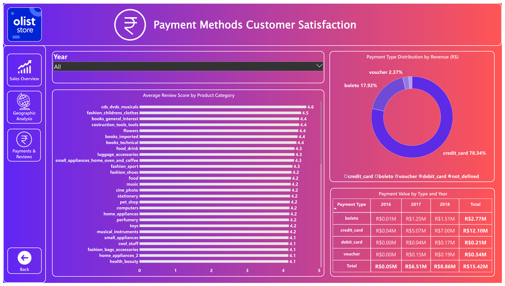
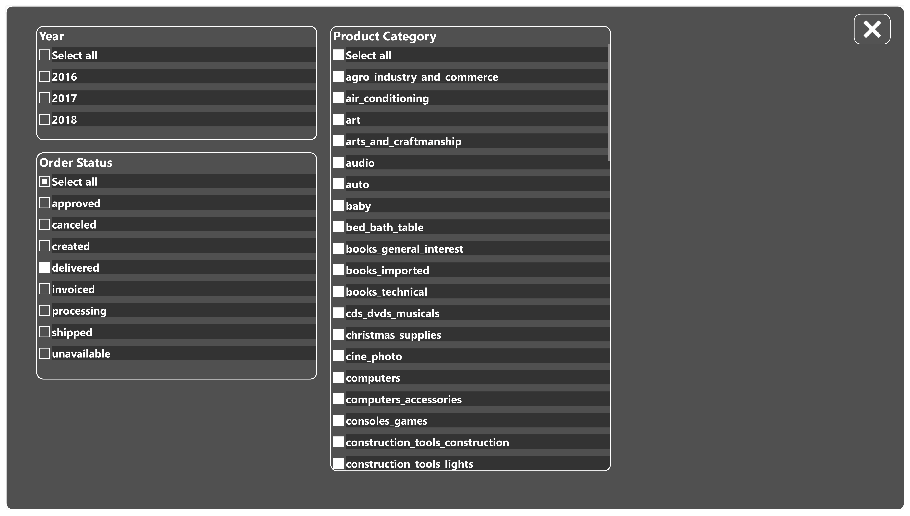

# 📊 Olist E-Commerce Sales Dashboard


A modern and interactive **Power BI dashboard** built using the **Olist Brazilian E-Commerce Dataset**. This project provides actionable insights into sales performance, customer behavior, product categories, payment methods, delivery performance, and business growth through intuitive visualizations and KPIs.

---

## 📌 Project Overview

The goal of this project is to transform raw e-commerce data into meaningful business insights using Power BI.

The dashboard enables stakeholders to:

- Monitor overall business performance
- Analyze customer purchasing trends
- Identify top-performing product categories
- Track revenue and order growth
- Evaluate delivery performance
- Explore sales geographically
- Make data-driven business decisions

---

## 🚀 Dashboard Features

- 📈 Executive KPI Dashboard
- 💰 Total Revenue Analysis
- 📦 Total Orders
- 👥 Customer Insights
- ⭐ Review Score Analysis
- 🛍 Product Category Performance
- 🌎 Sales by State
- 💳 Payment Method Analysis
- 🚚 Delivery Performance Tracking
- 📅 Time Series Sales Trends
- 🎛 Interactive Filters & Slicers
- 🔍 Drill-through Analysis

---

## 📊 Key Metrics

- Total Sales
- Total Orders
- Average Order Value
- Average Review Score
- Total Customers
- Revenue by Category
- Orders by State
- Payment Distribution
- Monthly Sales Trend
- Delivery Time Analysis

---

## 🛠 Tools & Technologies

| Tool | Purpose |
|------|---------|
| Power BI Desktop | Dashboard Development |
| Power Query | Data Cleaning & Transformation |
| DAX | Calculated Measures & KPIs |
| Data Modeling | Star Schema Relationships |
| Excel / CSV | Data Source |

---

## 📂 Dataset

The project uses the **Olist Brazilian E-Commerce Public Dataset**, which contains information about:

- Customers
- Orders
- Order Items
- Products
- Sellers
- Reviews
- Payments
- Geolocation

---

## 📸 Dashboard Preview

### 📈 Sales Overview


---

### 🌍 Geographic Analysis


---

### 💳 Payments & Reviews


---

### 🎛️ Filters


---

## 📁 Repository Structure

```
📦 Olist-PowerBI-Dashboard
│
├── PR_3_Dashboard.pbix
├── README.md
└── Images
    ├── Sales-Overview.png
    ├── Geographic-Analysis.png
    ├── Payments-and-Reviews.png
    └── Filters.png

```

---

## 📈 Data Analysis Process

1. Data Collection
2. Data Cleaning
3. Data Transformation
4. Data Modeling
5. DAX Calculations
6. Dashboard Design
7. Business Insights

---

## ✨ Dashboard Highlights

- Modern UI Design
- Responsive Layout
- Interactive Navigation
- Dynamic Filters
- KPI Cards
- Geographic Analysis
- Trend Analysis
- Drill-through Pages
- Custom Icons & Visuals

---

## 💡 Business Insights

The dashboard helps answer questions like:

- Which product categories generate the highest revenue?
- Which states contribute the most sales?
- How are customer review scores distributed?
- Which payment methods are most popular?
- How do monthly sales change over time?
- What factors affect delivery performance?

---

## 🎯 Skills Demonstrated

- Power BI
- Power Query
- DAX
- Data Modeling
- Business Intelligence
- Data Visualization
- Dashboard Design
- Data Analytics

---

## 👨‍💻 Author

**Pratik Patil**

GitHub: https://github.com/Pratik-Patil-AI

---

## ⭐ Support

If you found this project useful, consider giving it a ⭐ on GitHub.

It helps support my work and motivates me to build more data analytics projects.
